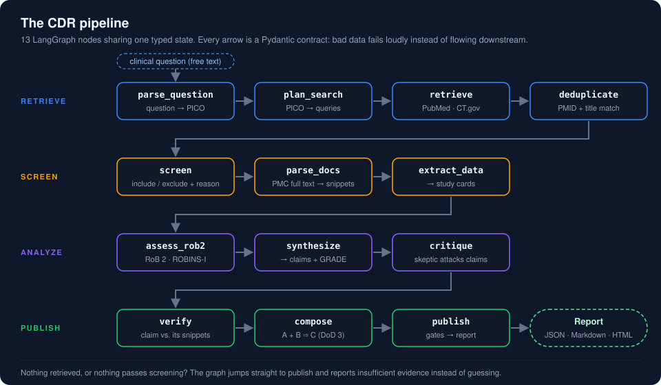

# CDR Architecture

> Pipeline design, data flow, and stage contracts for Clinical Deep Research v0.1

## Overview

CDR is a **13-node LangGraph StateGraph** pipeline that automates clinical evidence retrieval, screening, extraction, bias assessment, synthesis, and verification.

<div align="center">

</div>

The pipeline is organized into four color-coded phases:

| Phase | Color | Nodes |
|-------|-------|-------|
| **Retrieval** | 🔵 Blue | parse_question, plan_search, retrieve, deduplicate |
| **Screening** | 🟡 Amber | screen, parse_docs, extract_data |
| **Analysis** | 🟣 Purple / 🔴 Red | assess_rob2, synthesize, critique |
| **Output** | 🟢 Green | verify, compose, publish |

## Data Model

All data flows through **`CDRState`** — a Pydantic model that holds every artifact produced by the pipeline. Each node reads from and writes to specific fields on this state.

```
CDRState
├── question: str                           # Original clinical question
├── pico: PICO                              # Structured P-I-C-O
├── search_plan: SearchPlan                 # Planned queries
├── executed_searches: list[ExecutedSearch]  # PRISMA-S audit trail
├── records: list[Record]                   # Retrieved evidence
├── screening_decisions: list[ScreeningDecision]
├── snippets: list[Snippet]                 # Citable passages
├── study_cards: list[StudyCard]            # Structured extractions
├── rob2_results: list[RoB2Result]          # Bias assessment (RCTs)
├── robins_i_results: list[ROBINSIResult]   # Bias assessment (observational)
├── claims: list[EvidenceClaim]             # Evidence claims
├── synthesis: SynthesisResult              # Synthesis metadata
├── critiques: list[Critique]               # Adversarial findings
├── verification: list[VerificationResult]  # Per-claim checks
├── composed_hypotheses: list[dict]         # A+B⇒C inferences
├── prisma_counts: PRISMACounts             # PRISMA flow data
├── report: dict                            # Final JSON output
├── status: RunStatus                       # Pipeline status
└── errors: list[str]                       # Runtime errors
```

## Stage Contracts

Each node has typed inputs and outputs. **If a contract is violated, the pipeline fails loudly.**

### 1. parse_question

| | Type | Description |
|---|---|---|
| **In** | `str` (question) | Natural-language clinical question |
| **Out** | `PICO` | population, intervention, comparator, outcome, study_types |

**Invariants**: population, intervention, outcome ≥3 chars; comparator_source is set.

### 2. plan_search

| | Type | Description |
|---|---|---|
| **In** | `PICO` | Structured question |
| **Out** | `SearchPlan` | PubMed query (MeSH + Boolean), CT.gov query (≤500 chars) |

### 3. retrieve

| | Type | Description |
|---|---|---|
| **In** | `SearchPlan` | Planned queries |
| **Out** | `list[Record]` + `list[ExecutedSearch]` | Retrieved records + PRISMA-S audit |

**Sources**: PubMed E-utilities, ClinicalTrials.gov v2 API.

### 4. deduplicate

| | Type | Description |
|---|---|---|
| **In** | `list[Record]` | All retrieved records |
| **Out** | `list[Record]` | Deduplicated (PMID + title similarity ≥0.85) |

**Invariant**: `len(output) + duplicates_removed == len(input)`.

### 5. screen

| | Type | Description |
|---|---|---|
| **In** | `list[Record]` + `PICO` | Records + criteria |
| **Out** | `list[ScreeningDecision]` | Per-record include/exclude with reason code |

**Invariant**: Every record gets exactly one decision. Every exclusion has a `reason`.

### 6. parse_docs

| | Type | Description |
|---|---|---|
| **In** | `list[Record]` (included) | Records passing screening |
| **Out** | `list[Snippet]` | Text passages with section + source_ref |

**Source**: PMC Open Access (JATS XML). Abstracts used as fallback.

### 7. extract_data

| | Type | Description |
|---|---|---|
| **In** | `list[Snippet]` + `list[Record]` | Evidence text |
| **Out** | `list[StudyCard]` | Structured study summaries (type, sample size, outcomes) |

### 8. assess_rob2

| | Type | Description |
|---|---|---|
| **In** | `list[StudyCard]` + `list[Snippet]` | Study data |
| **Out** | `list[RoB2Result]` + `list[ROBINSIResult]` | Bias assessment |

**Invariant**: RoB2 = exactly 5 domains; ROBINS-I = exactly 7 domains.

### 9. synthesize

| | Type | Description |
|---|---|---|
| **In** | `list[StudyCard]` + `list[Snippet]` + `list[RoB2Result]` | All evidence |
| **Out** | `list[EvidenceClaim]` + `SynthesisResult` | Claims with traceability |

**Invariant**: Every claim has `supporting_snippet_ids` (≥1). Claim text 20–1000 chars.

### 10. critique

| | Type | Description |
|---|---|---|
| **In** | `list[EvidenceClaim]` + `list[Snippet]` | Claims + evidence |
| **Out** | `list[Critique]` | Adversarial findings with dimension + severity |

### 11. verify

| | Type | Description |
|---|---|---|
| **In** | `list[EvidenceClaim]` + `list[Snippet]` | Claims + evidence |
| **Out** | `dict[str, VerificationResult]` | Per-claim: verified/partial/contradicted/unverifiable |

**Quality gates**: citation_coverage ≥90%, snippet_coverage = 100%.

### 12. compose

| | Type | Description |
|---|---|---|
| **In** | `list[EvidenceClaim]` (verified) | Verified claims |
| **Out** | `list[ComposedHypothesis]` | A+B⇒C inferences with confidence + reasoning trace |

### 13. publish

| | Type | Description |
|---|---|---|
| **In** | `CDRState` (complete) | All pipeline artifacts |
| **Out** | Report JSON + `RunStatus` | Validated output conforming to `schemas/report.schema.json` |

**Invariant**: Clinical disclaimer always present. `unpublishable` if quality gates fail.

## External Dependencies

```
┌─────────────────────────────────────────────┐
│                CDR Pipeline                  │
│                                              │
│  ┌──────────┐  ┌────────────┐  ┌─────────┐ │
│  │ LLM      │  │ Retrieval  │  │ Storage │ │
│  │ Providers │  │ APIs       │  │         │ │
│  └────┬─────┘  └─────┬──────┘  └────┬────┘ │
└───────┼──────────────┼──────────────┼───────┘
        │              │              │
   ┌────▼────┐   ┌─────▼─────┐  ┌────▼────┐
   │ Gemini  │   │ PubMed    │  │ SQLite  │
   │ OpenAI  │   │ E-utils   │  │ (local) │
   │ Anthropic│   │           │  └─────────┘
   │ HF      │   │ CT.gov    │
   │ Groq    │   │ v2 API    │
   │ Cerebras│   │           │
   │ OpenRtr │   │ PMC OA    │
   │ Cloudflr│   │ JATS XML  │
   └─────────┘   └───────────┘
```

## Key Design Decisions

| Decision | Rationale | Reference |
|----------|-----------|-----------|
| LangGraph StateGraph (not agents) | Predictable execution, typed state, testable nodes | [Case study](case-study.md#1-langgraph-over-bare-agents) |
| Pydantic models with strict validation | Contract enforcement at every boundary | [Case study](case-study.md#2-pydantic-contracts-over-free-form-dicts) |
| Verification before publish | Safety: unsupported claims never published | [Case study](case-study.md#3-verification-before-publish-not-optional) |
| Multi-provider LLM, no fine-tuning | Reproducibility across providers | [Case study](case-study.md#4-multi-provider-llm-with-no-fine-tuning) |
| PMC OA fulltext only | Legal, free, structured (JATS) | [Case study](case-study.md#5-fulltext-via-pmc-open-access-only) |
| SQLite persistence | Zero-config, sufficient for v0.1 | [Case study](case-study.md#6-sqlite-for-persistence-not-postgres) |
| Immutable records (Pydantic frozen) | PRISMA count correctness | [INC-003](incidents.md#inc-003-prisma-count-arithmetic-failures) |

## File Organization

```
src/cdr/
├── api/                    # FastAPI routes (18 endpoints)
├── composition/            # A+B⇒C hypothesis generation
├── core/
│   ├── schemas.py          # Pydantic contracts (CDRState, PICO, Record, ...)
│   └── enums.py            # All enum types
├── evaluation/             # Golden set, metrics, semantic harness
├── extraction/             # Study card extraction (DSPy-based)
├── llm/                    # Multi-provider LLM abstraction
│   ├── factory.py          # Provider factory + fallback chain
│   └── *_provider.py       # One file per provider (8 of them)
├── observability/          # Tracing + metrics (OpenTelemetry-compatible)
├── orchestration/
│   ├── graph.py            # LangGraph graph builder + runner (~500 lines)
│   └── nodes/              # 7 node modules (split from monolith)
├── publisher/              # Markdown, JSON, HTML report generation
├── retrieval/              # PubMed, CT.gov, PMC clients
├── screening/              # PICO-based inclusion/exclusion
├── storage/                # SQLite RunStore with checkpoints
└── verification/           # Citation coverage + entailment checks
```

## Further Reading

- [Pipeline contracts (detailed)](contracts/pipeline_contracts.md) — Full I/O specification per stage
- [Report JSON Schema](../schemas/report.schema.json) — Machine-readable output contract
- [Case study](case-study.md) — Design decisions and tradeoffs
- [EVAL.md](evaluation.md) — Evaluation methodology
